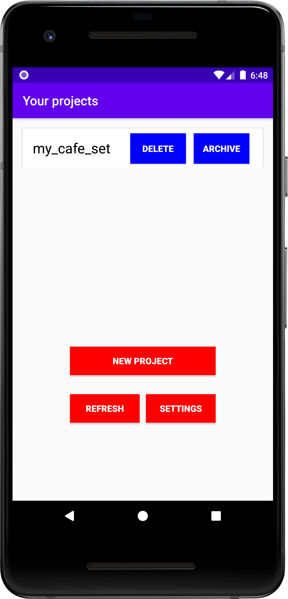
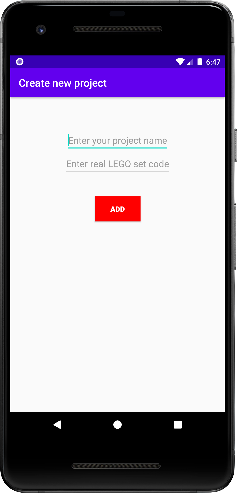
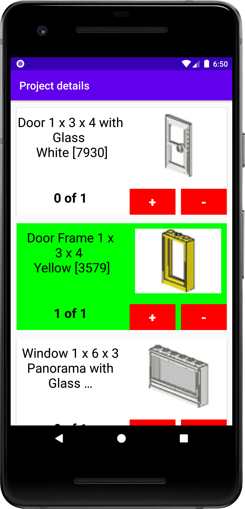
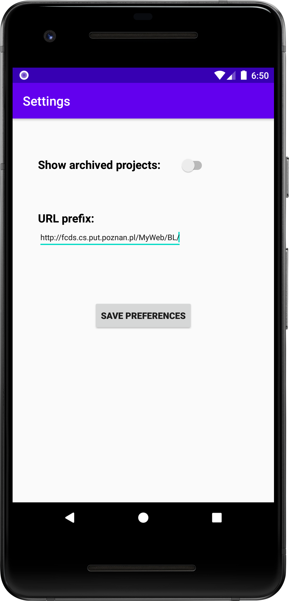

<h2> BrickList </h2>
<h4>The purpose of this app is to help you find all Lego parts for your old set</h4>

 
<h2> How to run: </h2>
Create a new Android Studio project and replace the existing <i>app</i> folder with this one.
